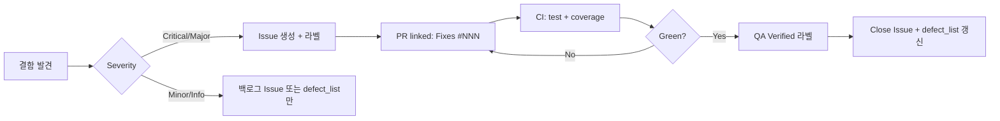

# Gilded Rose 결함 관리 보고서

작성일: 2026-05-19  
관련 문서: [요구사항 분석](requirements_analysis.md) · [테스트 계획](test_plan.md) · [결함 목록](defect_list.md)

본 문서는 Gilded Rose 프로젝트의 **결함 분류 체계**, **결함 보고서 템플릿**, **품질 메트릭 수집 계획**, **(선택) GitHub Issues 연동**을 정의한다. QA 리드는 이 문서를 기준으로 결함을 등록·추적·종결한다.

---

## 1. 결함 분류 체계

### 1.1 Severity 정의

| Severity | 정의 | 대응 SLA (권장) | 예시 |
|---|---|---|---|
| **Critical** | 핵심 비즈니스 규칙이 무력화되거나 데이터 무결성(`quality` 범위, Sulfuras 불변)이 깨짐. 프로덕션 배포 차단. | 즉시 (당일) | `Sulfuras` 품질 변경, `quality`가 음수로 내려감 |
| **Major** | 요구사항 미충족·회귀 테스트 실패·신규 기능(Conjured) 미구현. 배포 전 수정 필수. | 1~2 영업일 | Conjured 2배 감소 미적용, P0 테스트 Red |
| **Minor** | 제한된 조건에서만 발생하거나 우회 가능. 기능은 동작하나 품질·유지보수성 저하. | 다음 스프린트 | 비표준 이름 분기 오류, 문서·설정 불일치 |
| **Info** | 개선 제안·기술 부채·테스트 보강 권고. 결함으로 분류하되 릴리스 게이트에는 포함하지 않음. | 백로그 | 매직 넘버, 중복 조건문, 커버리지 미달 구간 |

### 1.2 ItemType 정의 (5종)

도메인 결함은 **아이템 타입** 기준으로 분류한다. 요구사항 분석의 5가지 아이템 규칙과 1:1로 대응한다.

| ItemType | 식별 기준 | 주요 검증 포인트 |
|---|---|---|
| **Normal** | 특별 아이템 이름과 일치하지 않는 일반 아이템 | `sellIn` `-1`, `quality` `-1` / 기한 경과 `-2`, 하한 `0` |
| **AgedBrie** | `name == "Aged Brie"` | 증가·상한 `50`, 기한 경과 `+2` |
| **BackstagePass** | `name == "Backstage passes to a TAFKAL80ETC concert"` | 구간별 `+1/+2/+3`, 콘서트 후 `quality == 0` |
| **Sulfuras** | `name == "Sulfuras, Hand of Ragnaros"` | `sellIn`·`quality` 불변, `quality == 80` |
| **Conjured** | `"Conjured"` 접두어 계열 (예: `"Conjured Mana Cake"`) | 기한 전 `-2`, 경과 후 `-4`, 하한 `0` |

> **비도메인 결함** (테스트 코드, 빌드·IDE 설정 등)은 ItemType 대신 **태그** `Test`, `TestEnvironment`, `Infrastructure`를 부여한다. Severity 매트릭스에는 도메인 5종 열을 사용하고, 비도메인 항목은 해당 열을 `—`(해당 없음)으로 두고 태그로만 추적한다.

### 1.3 Severity × ItemType 매트릭스

셀 값은 **해당 조합에서의 전형적 결함 영향**과 **필수 대응**을 나타낸다.

| Severity ↓ / ItemType → | Normal | AgedBrie | BackstagePass | Sulfuras | Conjured |
|---|---|---|---|---|---|
| **Critical** | `quality < 0` 또는 무한 감소 | `quality > 50` 무제한 증가 | 콘서트 전 `quality` 소실·음수 | `quality` 또는 `sellIn` 변경 | `quality < 0` 또는 일반 규칙으로 오분류 |
| **Major** | 기한 경과 `-2` 미적용 | 기한 경과 `+2` 미적용 | 구간 `+2/+3` 오류·콘서트 후 `≠ 0` | (도메인상 Critical에 가까움) | 2배 감소·경과 `-4` 미구현 |
| **Minor** | 비표준 이름이 Normal로 처리 | `49→50` 경계 오류 | `sellIn == 11` 경계 off-by-one | `sellIn`만 변경되는 버그 | 접두어 정책과 다른 이름 처리 |
| **Info** | 리팩토링·가독성 | 상수 미추출 | 임계값 매직 넘버 | 주석·명명 개선 | 이름 매칭 정책 문서화 |

**비도메인 태그 × Severity (참고)**

| Severity | Test | TestEnvironment | Infrastructure |
|---|---|---|---|
| Critical | P0 전체 Red·골든마스터 불일치 | CI 파이프라인 전면 실패 | — |
| Major | Placeholder·잘못된 기대값 (DEF-001) | CTest 경로 미설정 (DEF-004) | CMake 타깃 누락 |
| Minor | 테스트 이름·픽스처 중복 | 로컬/CI 결과 불일치 | 커버리지 리포트 경로 오류 |
| Info | 커버리지 보강 제안 | VS Code 설정 개선 | 문서 링크 깨짐 |

### 1.4 결함 ID 규칙

- 형식: `DEF-NNN` (3자리 순번, 예: `DEF-001`)
- 등록 시 필수 필드: `Severity`, `ItemType`(또는 비도메인 태그), `Status`, `발견 단계`
- 상태: `Open` → `In Progress` → `Fixed` → `Verified` → `Closed` (재발 시 `Reopened`)

---

## 2. 결함 보고서 템플릿

아래 템플릿을 복사해 결함 1건당 1절(또는 GitHub Issue 1건)으로 작성한다. 상세 이력은 [defect_list.md](defect_list.md)에 누적한다.

```markdown
## [DEF-XXX] [Severity] [ItemType 또는 태그]

| 항목 | 내용 |
|---|---|
| **제목** | 한 줄 요약 (동작 + 기대 불일치) |
| **Severity** | Critical / Major / Minor / Info |
| **ItemType** | Normal / AgedBrie / BackstagePass / Sulfuras / Conjured |
| **태그** | (선택) Test, TestEnvironment, Infrastructure |
| **발견 단계** | 요구사항 검토 / 단위 테스트 / 통합·승인 테스트 / 리팩토링 / 회귀 |
| **상태** | Open / In Progress / Fixed / Verified / Closed |
| **담당** | |
| **연관 요구사항** | requirements_analysis.md §절 번호 |
| **연관 테스트** | `GildedRoseTest.*` 또는 CTest 이름 |

### 재현 (Reproduce)

1. 전제 조건 (빌드 디렉터리, 브랜치, 테스트 바이너리)
2. 입력 데이터 (`name`, `sellIn`, `quality`)
3. 실행 명령
4. 호출 횟수 (`updateQuality()` n회)

### 기대 (Expected)

- `sellIn`, `quality` 기대값 (표 또는 bullet)
- 참조: 요구사항 문장 또는 테스트 시나리오 번호

### 실제 (Actual)

- 관측된 `sellIn`, `quality`
- 테스트 실패 메시지 / 스택 (있을 경우)

### 원인 (Root Cause)

- 코드 위치 (`GildedRose.cpp` 함수·분기)
- 설계·요구사항 해석 오류 여부

### 수정 (Fix Summary)

- 변경 요약 (동작 변경 vs 리팩토링 분리)
- PR / 커밋 참조

### 검증 (Verification)

- [ ] 단위 테스트 추가·수정 후 Green
- [ ] `ctest --test-dir build --output-on-failure` 전체 통과
- [ ] (해당 시) 골든마스터 / 승인 테스트 통과
- [ ] (해당 시) 커버리지 목표 유지 (§3 참고)
- **검증 일자 / 검증자**:
```

### 2.1 등록 예시 (요약)

| ID | Severity | ItemType/태그 | 요약 |
|---|---|---|---|
| DEF-001 | Major | Test | Placeholder `Foo` 테스트 기대값 `fixme` |
| DEF-002 | Major | Conjured | 기한 전 `quality` 2배 감소 미구현 |
| DEF-003 | Major | Conjured | `sellIn == 0` 경과 후 `-4` 미적용 |
| DEF-004 | Minor | TestEnvironment | VS Code CMake 소스·빌드 경로 미지정 |

전체 재현·기대·실제·원인·수정·검증 내용은 [defect_list.md](defect_list.md)를 참조한다.

---

## 3. 품질 메트릭 수집 계획

### 3.1 수집 메트릭 정의

| 메트릭 | 정의 | 산식 | 목표 (본 프로젝트) |
|---|---|---|---|
| **테스트 통과율** | CTest/Google Test 실행 결과 | `통과 테스트 수 / 전체 테스트 수 × 100` | **100%** (P0·P1 기준) |
| **라인 커버리지** | 실행된 소스 라인 비율 | 도구별 리포트 | `GildedRose.cpp` **≥ 90%** |
| **함수 커버리지** | 호출된 함수 비율 | 도구별 리포트 | **≥ 95%** |
| **브랜치 커버리지** | 분기 실행 비율 | 도구별 리포트 | **≥ 85%** (`updateQuality` 분기 우선) |
| **단계별 결함 발견율** | 해당 단계에서 **최초 등록**된 결함 비율 | `단계별 신규 결함 수 / 전체 신규 결함 수 × 100` | 추적·개선용 (목표치 없음) |
| **결함 밀도** | (선택) 코드 규모 대비 | `결함 수 / KLOC` | 스프린트 종료 시 1회 산출 |
| **재오픈율** | (선택) 검증 후 재발 | `Reopened / Closed × 100` | **< 10%** |

**발견 단계** (결함 발견율 집계용):

| 단계 | 설명 | 대표 활동 |
|---|---|---|
| RQ | 요구사항 검토 | requirements_analysis, 명세 리뷰 |
| UT | 단위 테스트 | Google Test `TEST_F`, TDD Red |
| IT | 통합·승인 | Golden Master, Texttest |
| RF | 리팩토링 | 구조 변경 후 회귀 |
| RG | 회귀 | CI, 릴리스 전 전체 스위트 |

### 3.2 수집 주기·담당

| 메트릭 | 주기 | 수집 시점 | 산출물 |
|---|---|---|---|
| 테스트 통과율 | 매 커밋·PR | `ctest` / CI job 종료 후 | CI 로그, `LastTest.log` |
| 커버리지 | PR·릴리스 전 | 커버리지 빌드 + 테스트 후 | HTML 리포트, 요약 JSON |
| 단계별 결함 발견율 | 스프린트 종료 | `defect_list.md` / Issues 라벨 집계 | 스프린트 QA 노트 |
| 결함 상태 분포 | 주 1회 | Open / Fixed / Verified 카운트 | 대시보드 또는 표 |

### 3.3 언어별 커버리지 도구

#### C++ (본 저장소 — gcov / lcov)

[test_plan.md](test_plan.md) §6.2와 동일한 절차를 따른다.

```bash
cd cpp
cmake -S . -B build-coverage -DCMAKE_BUILD_TYPE=Debug \
  -DCMAKE_CXX_FLAGS="--coverage -O0 -g" \
  -DCMAKE_EXE_LINKER_FLAGS="--coverage"
cmake --build build-coverage
ctest --test-dir build-coverage --output-on-failure

lcov --capture --directory build-coverage --output-file build-coverage/coverage.info
lcov --remove build-coverage/coverage.info '/usr/*' '*/_deps/*' '*/test/*' \
  --output-file build-coverage/coverage.filtered.info
genhtml build-coverage/coverage.filtered.info \
  --output-directory build-coverage/coverage-report

lcov --summary build-coverage/coverage.filtered.info
```

- **집계 대상**: `cpp/src/GildedRose.cpp` (필터에서 테스트·서드파티 제외)
- **Windows**: MinGW/MSYS2/WSL의 GCC 계열 사용. MSVC만 사용 시 OpenCppCoverage 등 대체 검토
- **통과율**: `ctest --test-dir build-coverage` 출력의 `tests passed` 비율 기록

#### Java (JaCoCo)

```bash
# Maven 예시
mvn clean test jacoco:report
# 리포트: target/site/jacoco/index.html
```

- `pom.xml`에 `jacoco-maven-plugin` 설정, `prepare-agent` + `report` goal
- 집계 패키지: `com.gildedrose` (구현 클래스만, 테스트 제외)
- CI: `mvn verify` 후 `jacoco.xml`을 Codecov/SonarQube에 업로드 (선택)

#### Python (pytest-cov)

```bash
pip install pytest pytest-cov
pytest --cov=gilded_rose --cov-report=html --cov-report=term-missing
# 리포트: htmlcov/index.html
```

- `pyproject.toml` 또는 `pytest.ini`에 `--cov-fail-under=90` 설정 가능
- 브랜치 커버리지: `pytest --cov=gilded_rose --cov-branch`

### 3.4 메트릭 기록 템플릿 (스프린트)

스프린트 종료 시 아래 표를 `docs/` 또는 Wiki에 1회 갱신한다.

| 일자 | 통과율 | 라인 % | 브랜치 % | 신규 결함 | UT% | IT% | RQ% | 비고 |
|---|---:|---:|---:|---:|---:|---:|---:|---|
| 2026-05-19 | 100% (27/27) | (측정 예정) | (측정 예정) | 4 | — | — | — | DEF-001~004 등록 |

### 3.5 품질 게이트 (릴리스 전)

1. P0 테스트 **100%** Green  
2. P1 (Conjured) 테스트 Green  
3. `GildedRose.cpp` 라인 **≥ 90%**, 브랜치 **≥ 85%**  
4. Critical/Major 결함 **0건** Open  
5. `Item` public 인터페이스 무변경 ([요구사항](requirements_analysis.md) §3.6)

---

## 4. (선택) GitHub Issues 연동 워크플로우

Issues를 결함 추적 SSOT로 사용할 때의 권장 흐름이다. 문서-only 운영 시에는 [defect_list.md](defect_list.md)만으로도 충분하다.

### 4.1 라벨 체계

| 라벨 | 용도 |
|---|---|
| `severity:critical` … `severity:info` | Severity |
| `item:normal` … `item:conjured` | ItemType (도메인) |
| `tag:test` / `tag:test-env` | 비도메인 |
| `phase:rq` … `phase:rg` | 발견 단계 |
| `status:verified` | QA 검증 완료 |

### 4.2 Issue 본문

- GitHub Issue 생성 시 **§2 결함 보고서 템플릿**을 본문에 붙여 넣는다.
- 제목 예: `[DEF-005][Major][Conjured] sellIn=0 경과 후 quality -4 미적용`

### 4.3 워크플로우



1. **발견**: Red 테스트 또는 리뷰 중 이슈 등록  
2. **개발**: `Fixes #123` / `Closes #123`로 PR 연결  
3. **CI**: PR에서 `ctest` + (선택) coverage job  
4. **검증**: QA가 체크리스트(§2 검증) 확인 후 `status:verified`  
5. **종결**: Issue Close, `defect_list.md`에 동일 ID로 요약 1행 추가  

### 4.4 Issue Template 예시 (`.github/ISSUE_TEMPLATE/defect.yml`)

저장소에 템플릿을 둘 경우 필드: Severity, ItemType, 재현, 기대, 실제, 원인(개발자 작성), 수정 PR 링크, 검증 체크리스트.

### 4.5 자동화 (선택)

- PR에 `tests` workflow: `cmake --build` + `ctest`  
- `main` merge 시 주 1회 coverage artifact 업로드  
- Projects 보드: `Open` → `In Progress` → `QA` → `Done` 컬럼

---

## 5. 문서 유지보수

| 이벤트 | 갱신 대상 |
|---|---|
| 신규 결함 등록 | `defect_list.md` 상세 + (선택) GitHub Issue |
| 결함 종결 | `defect_list.md` 상태, §3.4 스프린트 표 |
| 요구사항·테스트 계획 변경 | 본 문서 §1.2·§3.5 게이트와 교차 검토 |
| 커버리지 도구 변경 | §3.3 해당 언어 절 |

---

## 부록: 현재 스냅샷 (2026-05-19)

- **테스트 통과율**: 27/27 (100%) — `ctest --test-dir build --output-on-failure`
- **등록 결함**: DEF-001 ~ DEF-004 ([defect_list.md](defect_list.md))
- **Open Critical/Major**: 0 (모두 수정·검증 완료로 기록됨)
- **커버리지**: `build-coverage` 빌드 후 §3.3 C++ 절차로 측정 권장
